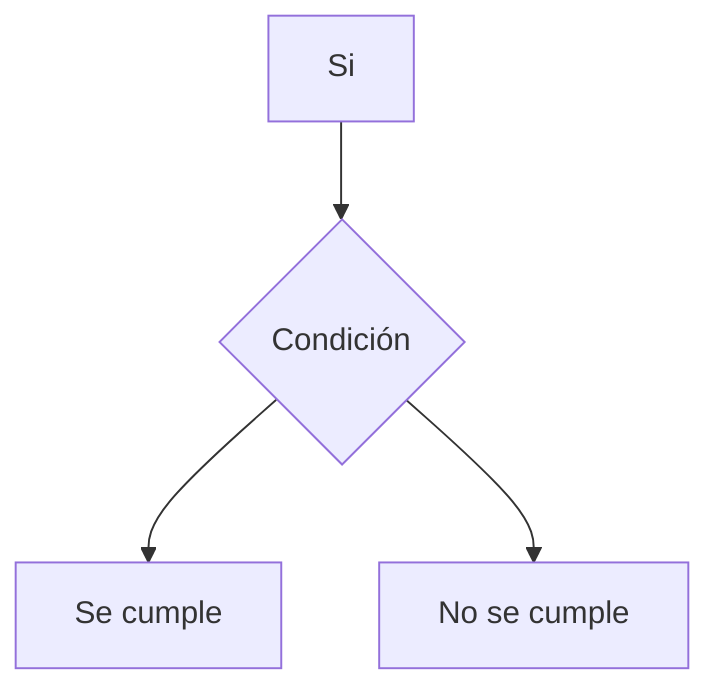

# Estructuras de Control

En esta sesión trabajaremos el concepto de estructuras de control; las estructuras condicionales: if, else, elif., y estructuras de control iterativas: while, for, range.

## Condicionales

Hasta ahora hemos trabajado en programas sencillos y bastantes limitados en su capacidad. Que pasará cuando necesitamos desviar el camino de nuestro programa dependiendo de los datos de entrada que recibamos?

Por ejemplo: 

```python
edad = input('Ingrese la edad de Juan: ')

print(f'La edad de Juan es {edad} años.')
```

Qué pasa si la edad de Juan es un año? Nos devolvería algo así:

`La edad de Juan es 1 años.`

Deberíamos contar con una herramienta para detectar si la edad de Juan es igual a 1 mostrar este otro mensaje:

`La edad de Juan es 1 año.`

Para este objetivo, los modelos matemáticos que venimos empleando no alcanzan. Necesitamos otro Modelo Formal; y el Modelo Lógico es la respuesta.

## Introducción a lógica

Todos los lenguajes disponen de mecanismos para preguntar y responder haciendo uso de expresiones y operadores lógicos. 

En todos los lenguajes se hace uso de la lógica simbólica o lógica bivalente, el cual es un modelo lógico que viene de maravilla para este propósito.

En lógica binomial no existen las verdades a medias: si algo no es Verdadero, entonces es Falso; y viceversa. Pero algo no puede ser verdadero y falso al mismo tiempo.

## Expresiones Booleanas

El nombre teórico de una expresión lógica es **proposición**. En programación también las llamamos frecuentemente **expresiones booleanas**.

Todas las expresiones booleanas deben de poder evaluarse como **Verdaderas o Falsas**

**¿Por qué nos importa esto?** Porque todas las preguntas que nuestros programas necesiten formularse deberán estar escritas como expresiones lógicas.

En programación las llamamos **condiciones**. Y si sólo obtendrán como respuesta Si o No, entonces lo más
probable es que con una pregunta simple no le alcance al programa para identificar perfectamente una situación, caso o patrón. Así que, usaremos estas operaciones para elaborar preguntas tan sofisticadas como sea necesario.


## Operadores lógicos

Para realizar estas condiciones vamos a usar lo que llamamos operadores lógicos, que aplicados a una o dos expresiones nos devuelven Verdadero o Falso.

| Operador         | Descripción                                                                                                                            | Símbolo en Python |
|------------------|----------------------------------------------------------------------------------------------------------------------------------------|-------------------|
| Negación ( ~ )   | Es equivalente a “no”: si algo es Verdadero, lo convierte en Falso y viceversa                                                         | not               |
| Conjunción ( ^ ) | Es equivalente a “y”. Solamente da Verdadero si todas las expresiones que evalúa son verdaderas.                                       | and               |
| Disyunción ( v ) | Es equivalente a “o”. Da verdadera si alguna de las expresiones que evalúa es Verdadera.Falso cuando todas las expresiones son falsas. | or                |

Para cada operador lógico se tienen **Tablas de Verdad**, las cuales nos dan el resultado de usar estos operadores con diferentes valores de verdad:

### AND

| A         | B         | Resultado     |
|-----------|-----------|---------------|
| Verdadero | Verdadero | **Verdadero** |
| Verdadero | Falso     | **Falso**     |
| Falso     | Verdadero | **Falso**     |
| Falso     | Falso     | **Falso**     |

### OR

| A         | B         | Resultado     |
|-----------|-----------|---------------|
| Verdadero | Verdadero | **Verdadero** |
| Verdadero | Falso     | **Verdadero** |
| Falso     | Verdadero | **Verdadero** |
| Falso     | Falso     | **Falso**     |

### NOT

| A         | Resultado     |
|-----------|---------------|
| Verdadero | **Falso**     |
| Falso     | **Verdadero** |

Las expresiones lógicas complejas (más de un operador) se resuelven (igual que en matemáticas) respetando precedencias y de izquierda a derecha. También admiten el uso de () para alterar precedencias.


## If

Las sentencias condicionales pertenecen a lo que llamamos **estructuras de control condicionales**, y se denominan de esta manera porque permiten alterar el **Flujo de Control Normal** de un Programa (**FCP**).

En muchos lenguajes podemos encontrar la misma sentencia condicional o alguna forma de ella: **if**




