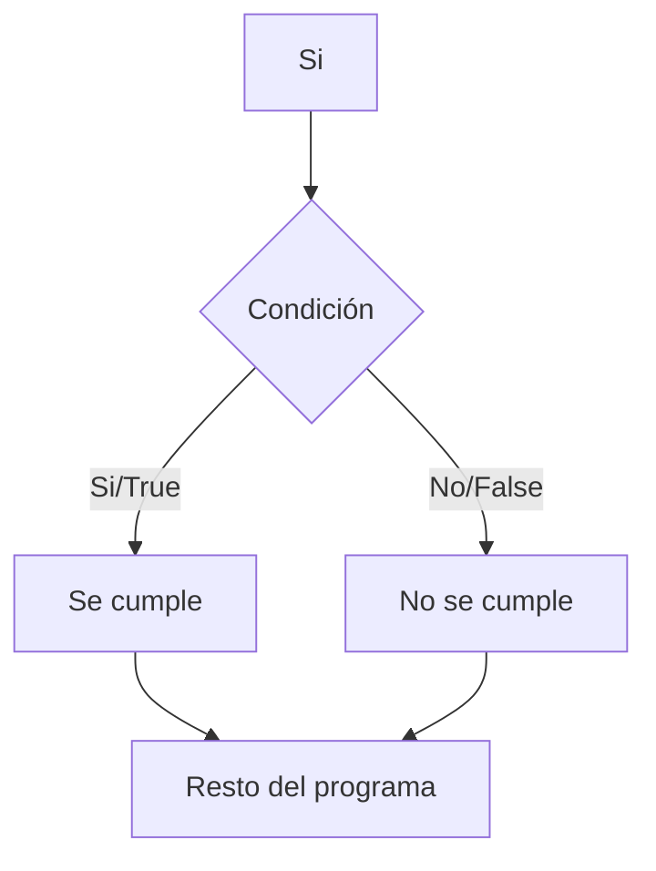
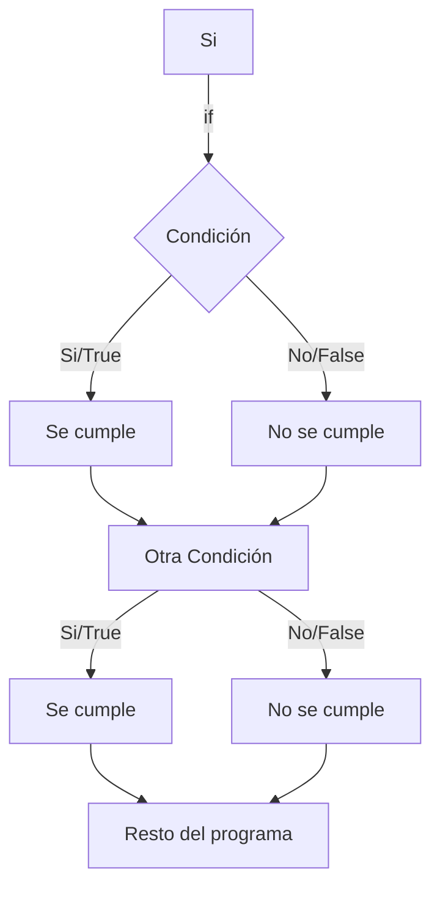
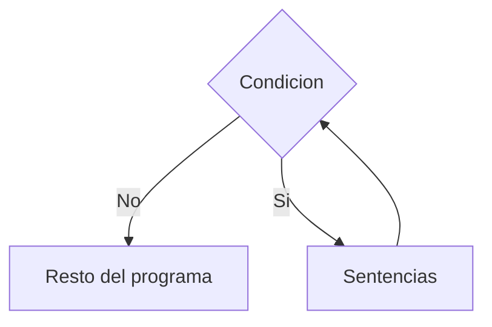

# Estructuras de Control

En esta sesión trabajaremos el concepto de estructuras de control; las estructuras condicionales: if, else, elif., y estructuras de control iterativas: while, for, range.

## Condicionales

Hasta ahora hemos trabajado en programas sencillos y bastantes limitados en su capacidad. Que pasará cuando necesitamos desviar el camino de nuestro programa dependiendo de los datos de entrada que recibamos?

Por ejemplo: 

```python
edad = input('Ingrese la edad de Juan: ')

print(f'La edad de Juan es {edad} años.')
```

Qué pasa si la edad de Juan es un año? Nos devolvería algo así:

`La edad de Juan es 1 años.`

Deberíamos contar con una herramienta para detectar si la edad de Juan es igual a 1 mostrar este otro mensaje:

`La edad de Juan es 1 año.`

Para este objetivo, los modelos matemáticos que venimos empleando no alcanzan. Necesitamos otro Modelo Formal; y el Modelo Lógico es la respuesta.

## Introducción a lógica

Todos los lenguajes disponen de mecanismos para preguntar y responder haciendo uso de expresiones y operadores lógicos. 

En todos los lenguajes se hace uso de la lógica simbólica o lógica bivalente, el cual es un modelo lógico que viene de maravilla para este propósito.

En lógica binomial no existen las verdades a medias: si algo no es Verdadero, entonces es Falso; y viceversa. Pero algo no puede ser verdadero y falso al mismo tiempo.

## Expresiones Booleanas

El nombre teórico de una expresión lógica es **proposición**. En programación también las llamamos frecuentemente **expresiones booleanas**.

Todas las expresiones booleanas deben de poder evaluarse como **Verdaderas o Falsas**

**¿Por qué nos importa esto?** Porque todas las preguntas que nuestros programas necesiten formularse deberán estar escritas como expresiones lógicas.

En programación las llamamos **condiciones**. Y si sólo obtendrán como respuesta Si o No, entonces lo más
probable es que con una pregunta simple no le alcance al programa para identificar perfectamente una situación, caso o patrón. Así que, usaremos estas operaciones para elaborar preguntas tan sofisticadas como sea necesario.


## Operadores lógicos

Para realizar estas condiciones vamos a usar lo que llamamos operadores lógicos, que aplicados a una o dos expresiones nos devuelven Verdadero o Falso.

| Operador         | Descripción                                                                                                                            | Símbolo en Python |
|------------------|----------------------------------------------------------------------------------------------------------------------------------------|-------------------|
| Negación ( ~ )   | Es equivalente a “no”: si algo es Verdadero, lo convierte en Falso y viceversa                                                         | not               |
| Conjunción ( ^ ) | Es equivalente a “y”. Solamente da Verdadero si todas las expresiones que evalúa son verdaderas.                                       | and               |
| Disyunción ( v ) | Es equivalente a “o”. Da verdadera si alguna de las expresiones que evalúa es Verdadera.Falso cuando todas las expresiones son falsas. | or                |

Para cada operador lógico se tienen **Tablas de Verdad**, las cuales nos dan el resultado de usar estos operadores con diferentes valores de verdad:

### AND

| A         | B         | Resultado     |
|-----------|-----------|---------------|
| Verdadero | Verdadero | **Verdadero** |
| Verdadero | Falso     | **Falso**     |
| Falso     | Verdadero | **Falso**     |
| Falso     | Falso     | **Falso**     |

### OR

| A         | B         | Resultado     |
|-----------|-----------|---------------|
| Verdadero | Verdadero | **Verdadero** |
| Verdadero | Falso     | **Verdadero** |
| Falso     | Verdadero | **Verdadero** |
| Falso     | Falso     | **Falso**     |

### NOT

| A         | Resultado     |
|-----------|---------------|
| Verdadero | **Falso**     |
| Falso     | **Verdadero** |

Las expresiones lógicas complejas (más de un operador) se resuelven (igual que en matemáticas) respetando precedencias y de izquierda a derecha. También admiten el uso de () para alterar precedencias.


## If

Las sentencias condicionales pertenecen a lo que llamamos **estructuras de control condicionales**, y se denominan de esta manera porque permiten alterar el **Flujo de Control Normal** de un Programa (**FCP**).

En muchos lenguajes podemos encontrar la misma sentencia condicional o alguna forma de ella: **if**




El **FCP** llega a la condición, la evalúa y luego bifurca, por derecha o izquierda. Hay un grupo de sentencias que, en ese caso (debido a la respuesta obtenida), no se ejecutarán

En algún punto la bifurcación acaba y el FCP sigue su curso de manera unificada (al menos hasta la próxima bifurcación).




### Sintaxis del if en Python

La sentencia if es una de las Sentencias Estructuradas de Python (que se escribe en más de un renglón). Las sentencias estructuradas normalmente tienen una primera línea de encabezado y un cuerpo. El cuerpo siempre se escribe con indentación (desplazamiento del inicio del renglón a la derecha). Esta indentación debe ser igual para todas las sentencias del cuerpo y es la forma que tiene Python para identificar cuáles sentencias pertenecen a él.

```python
numero = 147

if (numero > 128):
    print('El numero es mayor a 128')
elif (numero > 208):
    print('El numero es mayor a 208')
else
    print('El numero debe de ser menor a 128')
```

elif es como decir “else if”, es el camino “no”, pero evaluando una nueva condición. Es una mezcla entre else + if

## Operadores en Python

Como vimos en el ejemplo podemos comparar, en el ejemplo anterior si la variable numero es mayor a 128 mostrara en consola un texto.

Python puede comparar valores de datos usando los operadores de comparación, o averiguar si un valor está dentro de un grupo, operadores de pertenencia. También existen los operadores lógicos que ya vimos su definición anteriormente.

###  Operadores de Comparación o Desigualdad:

| Símbolo | Definición    | Ejemplo |
|---------|---------------|---------|
| ==      | igual         | a == 4  |
| !=      | distinto      | b != 4  |
| <       | menor         | 2 < 4   |
| <=      | menor o igual | 2<=2    |
| >       | mayor         | 2 > 4   |
| >=      | mayor o igual | 2 >= 4  |


### Operadores de Pertenencia:

| Símbolo | Definición    | Ejemplo                  |
|---------|---------------|--------------------------|
| in      | Pertenece     | “razón” in “corazón”     |
| not in  | NO pertenece  | “razón” not in “corazón” |

Con estos pocos elementos podemos arreglarnos para hacer una colección de preguntas simples o sofisticadas, que en su conjunto nos permitan identificar cualquier situación o patrón que busquemos.


## Ciclos y Rangos

Aprendimos la definición de algoritmo, la cual nos decía algo como conjunto de pasos ordenados finitos. 

Que pasa cuando debemos repetir una acción hasta que suceda algo?

Te imaginas escribir un algoritmo paso a paso de como descargar 500 cajas de un camion? Tendrías que repetir 500 veces los pasos referidos a las cajas.

Por eso los lenguajes de programación se valen de herramientas como ciclos y bucles para repetir acciones bajo una condición.

## Definiciones

Los bucles son primitivas sencillas, normalmente tienen una sintaxis simple. Su dificultad no está en cómo se escriben, ni en entender su funcionamiento, sino en la manera en que se ajustan sus parámetros.

Esto es lo que nos garantizará que haga exactamente lo que esperamos. Tenemos que prestar atención tanto al código que debe repetir como a la cantidad de veces exacta que se va a repetir.

### ¿Cómo funciona un Ciclo?


El programa llega, entra (si se dan las condiciones) y se queda iterando allí (repitiendo el cuerpo) todas las veces que haga falta. Cuando las condiciones determinan el fin de las repeticiones se va del Ciclo, y no vuelve.

## While

El **while** es una sentencia de ciclo que nos permite ejecutar el cuerpo del ciclo **mientras** la condición sea verdadera, es decir:

```python
recreo = 0

while (recreo <= 15):

    if(recreo == 15):
        print('Chicos fin del recreo!!')
    
    if(recreo == 0):
        print('Chicos todos al recreo!')
    
    if((recreo > 0) and (recreo < 15)):
        print(f'Los chicos llevan {recreo} minutos')
        print('Esperamos un minuto más...')
    
    recreo += 1
```
En consola veremos los siguientes mensajes. El mensaje de cuantos minutos llevan los chicos en el recreo y de espera se repiten hasta llegar a los 15 minutos.

`Chicos todos al recreo!`

`Los chicos llevan 1 minutos` 

`Esperamos un minuto más...`

`Chicos fin del recreo!!`

### ¿Cómo se ejecuta while de Python?

Cuando el FCP llega a una sentencia while lo primero que se realiza es la evaluación de la condición. Si la condición da VERDADERO se ejecutará completamente el cuerpo del while. Cuando termina la ejecución del se evalúa nuevamente la condición: si da VERDADERO repite lo anterior; si da FALSO sale del while y ejecuta la sentencia siguiente al mismo. Si la primera vez que el FCP llega al while y evalúa la condición da FALSO, el FCP sigue de largo a la próxima sentencia y saltea todo el cuerpo.

Fíjense como en el ejemplo utilizamos una variable como condición y la comparamos con un numero para hacer que se repita las veces que necesitamos.

También fíjense como modificamos la variable para que en algún momento el ciclo while no cumpla la condición y salga de la iteración. 

Esto ultimo es muy importante ya que es muy fácil caer en ciclos infinitos.

## Break y Continue

Break y continue son dos palabras clave en Python que se utilizan en bucles, como el bucle while, para controlar el flujo de ejecución del programa.

### Break 

La declaración break se utiliza para salir inmediatamente de un bucle antes de que se complete su iteración normal. Cuando se encuentra una instrucción break, el programa salta fuera del bucle y continúa con la ejecución de las instrucciones que están después del bucle.

### Continue

La declaración continue se utiliza para saltar una iteración del bucle y continuar con la siguiente iteración. Cuando se encuentra una instrucción continue, el programa se salta el resto del bloque de código del bucle para esa iteración específica y continúa con la siguiente iteración.


## For

En Python también tenemos a disposición el bucle for. Este es un ciclo que tiene automatizado, o incorporado al encabezado, el manejo del estado previo y del paso. Es decir, no tenemos que estar controlando que el paso y el estado previo sean correctos. 

La sintaxis es la siguiente:

```python
manzanas = ['manzana roja', 'manzana verde', 'manzana roja arenosa', 'manzana roja deliciosa', 'manzana verde ácida']

for manzana in manzanas:
    print(f'Ahora estoy comiendo una {manzana}')
```
Si estuvieron atentos verán que se introdujo un nuevo tipo de dato, un iterable.

En el ejemplo se usa una lista de strings para recorrerla con el ciclo for. For ejecuta las sentencias que queramos por cada uno de los elementos de la lista.

Tanto break como continue funcionan de la misma forma para ciclos while y ciclos for

## Rangos

Tanto break como continue funcionan de la misma forma para ciclos while y ciclos for

Un rango es un constructor o estructura de control que permite generar una sucesión de números enteros, con un cierto paso o salto regular. 

La sintaxis es:

```python
inicio = 1
fin = 12 
paso = 2
range(inicio, fin, paso)
```
- El paso DEBE ser un entero
- El inicio está incluido en el rango, el fin NO.
- El inicio es opcional, por defecto es 1
- Si desea un rango decreciente debe colocar un paso negativo
- Al colocar paso, debe colocar un inicio aunque sea 0

Ejemplo:

| Rango           | Resultado         |
|-----------------|-------------------|
| range(1,10)a    | 1,2,3,4,5,6,7,8,9 |
| range(6)        | 0, 1, 2, 3, 4, 5  |
| range(0,8,2)    | 0, 2, 4, 6        |
| range(15,10,-5) | 15                |
| range(15,10,-1) | 15,14,13,12,11    |

## Ciclos anidados

Como ya vimos, un ciclo repite un bloque de sentencias (al que llamamos cuerpo del ciclo). Por supuesto que ese cuerpo puede estar conformado con cualquier combinación y cantidad de sentencias válidas de Python. Por lo tanto, resulta obvio suponer que dentro de un ciclo pueda haber otro. Cuando se da esto, decimos que los ciclos están anidados.

```python
print('Ingresá 10 números y te contamos cuántos divisores tiene cada uno')

for n in range(10):
    num = int(input('Ingresá un número entero positivo: '))

    while num <= 0:
        num=int(input('Ingresá un número entero positivo: '))
    
    cant_divisores = 0
    
    for d in range(2,num//2+1):
        if num % d == 0:
            cant_divisores += 1
    print(num,'tiene',cant_divisores,'divisores')
```